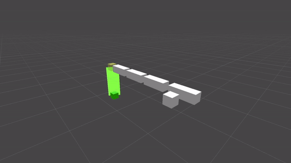

# Xaloc_Script_Review

Aquí teneis los scripts que hacen mover y controlar los siguientes proyectos.

Gameplay:

Fishing VR

Optimización:

RenderMeshInstanced - Waves

RenderMeshInstanced - Sticks

